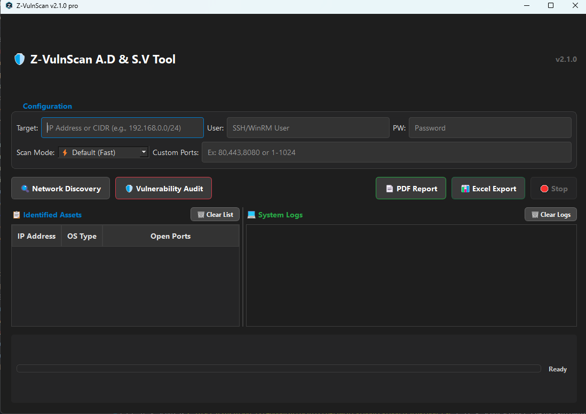
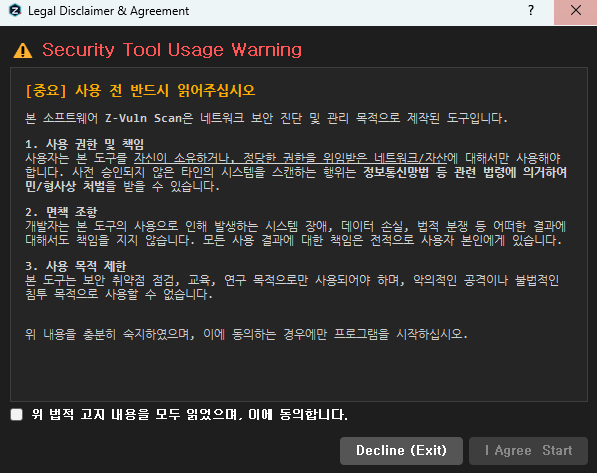
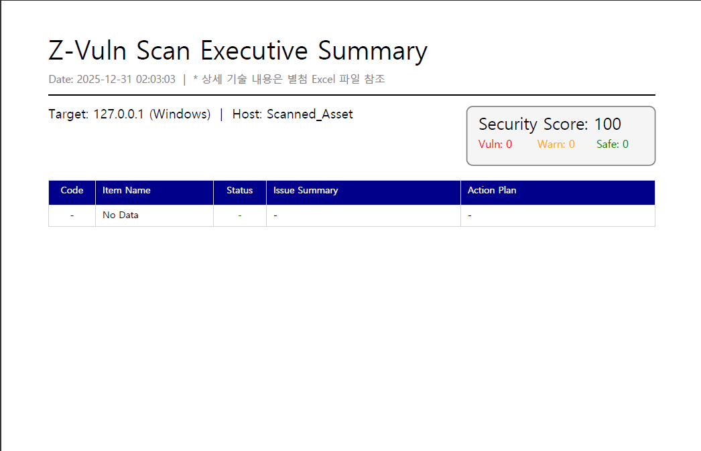
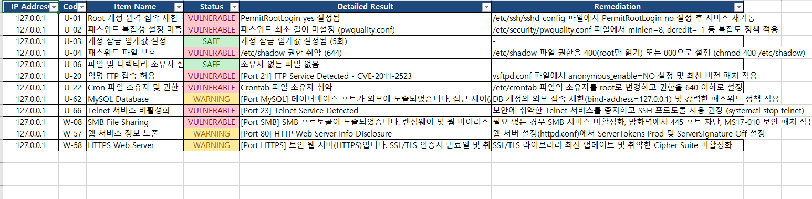

# Z-VulnScan Professional Edition v2.1
### 🛡️ Network Asset Discovery & Security Visibility Tool

   

**Z-VulnScan Professional**은 인가된 네트워크 환경에서 **자산 가시화, 포트 노출 현황 파악, 서비스 배너 수집**을 통해 보안 담당자가 **사전 위험 요소를 식별하고 점검 결과를 문서화**할 수 있도록 지원하는 **보안 가시화(Security Visibility) 및 사전 점검 도구**입니다.

본 도구는 **침투 테스트(PT) 또는 공격 도구가 아니며**, 보안 정책 수립, 교육, 내부 점검, 감사 대응을 위한 **보조 수단**으로 설계되었습니다.

---

## 📑 목차 (Table of Contents)
1. [🔐 법적 고지 및 윤리 규정](#-legal--ethical-notice-중요)
2. [🎯 권장 사용 목적](#-intended-use-권장-사용-목적)
3. [🚀 주요 기능](#-key-features)
4. [✅ 지원 진단 항목 (KISA)](#-supported-audit-list-kisa)
5. [📸 스크린샷](#-screenshots)
6. [🛠 기술 스택](#-technology-stack)
7. [🗓 로드맵](#-roadmap)
8. [📜 라이선스](#-license)

---

## 🔐 Legal & Ethical Notice (중요)

> ⚠ **[경고] 본 프로그램은 반드시 인가된 자산 및 네트워크 환경에서만 사용해야 합니다.**

- 본 도구는 **네트워크 포트 스캔, 서비스 정보 수집, OS 설정 진단 기능**을 포함합니다.
- 사전 허가 없이 제3자의 네트워크 또는 시스템을 스캔하는 행위는 **정보통신망법 등 관련 법률**에 의해 **형사·민사 책임**이 발생할 수 있습니다.
- 사용자는 본 도구 사용에 따른 **모든 법적 책임을 스스로 부담**합니다.
- **실행 절차:** 프로그램 최초 실행 시, 위 사항에 대한 **법적 고지 동의(Disclaimer Dialog)** 과정을 거쳐야만 기능이 활성화됩니다.

---

## 🎯 Intended Use (권장 사용 목적)

**Z-VulnScan Professional**은 다음과 같은 운영 환경에 최적화되어 있습니다.

| ✅ 권장 용도 | ❌ 금지된 용도 |
|---|---|
| • 내부 네트워크 **자산 식별 및 현황 파악** | • 침투 테스트 (Exploit 기반 공격) |
| • 서버/서비스 **노출 포트 및 배너 점검** | • 무차별 외부 네트워크 스캔 (Scanning) |
| • 보안 감사 전 **사전 점검(Pre-audit Checklist)** | • 서비스 거부 공격 (DoS) 시뮬레이션 |
| • 보안 교육 및 실습 환경 구축 | • 타인 소유 자산에 대한 비인가 접근 |
| • 점검 결과 **보고서(PDF/Excel) 자동화** | |

---

## 🚀 Key Features

### 1. 📡 Network Asset Discovery
- **ICMP Ping:** 활성 호스트의 신속한 생존 여부 탐지
- **ARP Scan:** 내부 네트워크 대역(L2)의 정밀한 자산 식별
- 인가된 로컬 네트워크 환경에 최적화된 스캔 엔진

### 2. 🔍 Port Exposure Scanning
- **Fast Scan:** 주요 Well-known 포트(Top 100) 빠른 점검
- **Full Scan:** 전체 포트(1-65535) 대상 정밀 노출 현황 분석
- **Custom Scan:** 사용자 정의 포트 범위 지정 가능
- **Scan Mode:** TCP Connect / TCP SYN Scan 모드 지원 (*관리자 권한 필요*)

### 3. 🏷️ Service Banner Collection
- 서비스 데몬의 배너 정보 수집 및 분석
- 소프트웨어 버전 및 서비스 유형 식별
- **Note:** CVE 직접 탐지 기능은 제공하지 않으며, 참고용 보안 정보(Reference)만 매핑합니다.

### 4. 📊 Professional Reporting
- **Excel Report (.xlsx):** 자산 목록, 포트 현황, 상세 진단 결과를 필터링 가능한 형태로 제공
- **PDF Report (.pdf):** 경영진 보고 및 감사 대응을 위한 요약/상세 통합 문서 자동 생성
- **Visual Alert:** 취약/경고 항목에 대한 시각적 강조 처리

### 5. 💻 Modern GUI Dashboard
- **PyQt5 기반 다크 모드 UI:** 장시간 분석 업무에 최적화
- **Real-time Status:** 진행률(Progress Bar), 남은 시간(ETA), 실시간 로그 콘솔 제공
- **Input Validation:** IP/Port 입력값 검증 및 오동작 방지 로직 적용

---

## ✅ Supported Audit List (KISA)

> ℹ **[참고]** 아래 항목은 대상 자산에 대한 **SSH/WinRM 인증 정보**가 제공된 경우 정밀 진단됩니다. v2.1에서 진단 항목이 대폭 확장되었습니다.

### 🐧 Linux Server (Unix 계열) - 70+ Items
| 코드 | 항목명 | 주요 점검 내용 |
|:---:|---|---|
| **U-01** | root 원격 접속 제한 | `sshd_config` 내 PermitRootLogin 설정 점검 |
| **U-02** | 패스워드 복잡성 설정 | `pwquality.conf` 등 암호 정책 설정 점검 |
| **U-20** | Anonymous FTP 비활성화 | 익명 FTP 접속 허용 여부 점검 |
| ... | ... | (U-01 ~ U-72 항목 지원) |

### 🪟 Windows Server - 80+ Items
| 코드 | 항목명 | 주요 점검 내용 |
|:---:|---|---|
| **W-01** | Administrator 계정 이름 변경 | 기본 관리자 계정명 변경 여부 |
| **W-08** | 하드디스크 기본 공유 제거 | C$, Admin$ 등 기본 공유 활성화 여부 |
| **W-60** | 최신 핫픽스 적용 | Windows 보안 업데이트 적용 상태 점검 |
| ... | ... | (W-01 ~ W-80 항목 지원) |

---

## 📸 Screenshots

| **Main Dashboard & Context Menu** | **Security Warning** |
|:---:|:---:|
|  |  |
| **PDF Report (Remediation Included)** | **Excel Report** |
|  |  |

---

## 🛠 Technology Stack

- **Language:** Python 3.13+
- **GUI Framework:** PyQt5 (Qt Designer)
- **Network Engine:** Scapy, Python Native Socket
- **Reporting Engine:** ReportLab (PDF), OpenPyXL (Excel)
- **Security:** `keyring` (Secure Storage), PyInstaller (Build)

---

## 🗓 Roadmap

### ✅ v2.1 (Current - Professional)
- [x] **Core:** 자산 탐지, 멀티 모드 포트 스캔, KISA 정밀 진단
- [x] **Security:** 자격증명 암호화 저장, 메모리 보호, 사용자 실수 방지 경고
- [x] **UX:** 컨텍스트 메뉴(RDP/SSH), 다크 모드 UI, 실시간 로그
- [x] **Reporting:** 조치 방안(Remediation)이 포함된 PDF/Excel 리포트

### 🔮 v3.0 (Future - Enterprise)
- [ ] **Headless Mode:** CLI 지원을 통한 스케줄러(Cron) 연동 및 자동화
- [ ] **SIEM Integration:** Syslog/CEF 포맷 로그 전송 기능
- [ ] **Centralized DB:** 로컬 SQLite를 넘어 MySQL/PostgreSQL 중앙 저장소 연동
- [ ] **Diff Report:** 지난 진단 결과와의 변동 사항(New/Fixed) 비교 리포트

---

## 📜 License

**Proprietary License**

Copyright © 2025 **Z-VulnScan Team**. All Rights Reserved.

본 소프트웨어는 **상용/비공개 소프트웨어**입니다. 저작권자의 사전 서면 허가 없이 본 소프트웨어의 전부 또는 일부를 무단으로 복제, 배포, 수정, 역공학(Reverse Engineering)하는 행위는 엄격히 금지됩니다.
